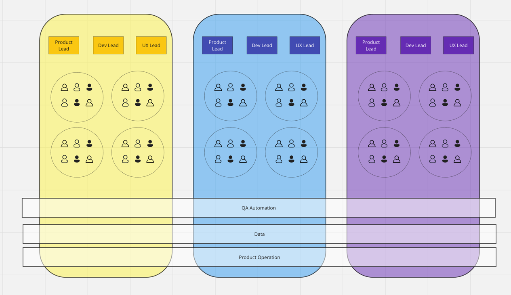

# R&D Structure

This section provides an overview of the organizational structure within our software development organization.
The structure is designed to ensure effective collaboration, efficient project management,
and the successful delivery of high-quality software products.

## Product line

Our organization is divided into distinct product lines,
each focused on a specific area of software development and product management.

This division helps streamline our efforts
and ensures that each product line receives dedicated attention and expertise.

### Product line leadership

The Product Lead, Development Lead,
and UX Lead work collaboratively to shape the strategic direction of their respective product lines.
They are responsible for setting the roadmap, prioritizing features,
and ensuring alignment with the organization's overarching goals.
Moreover,
this triad plays a pivotal role
in ensuring
that all new features and functionalities being developed are not only technically feasible but also valuable,
viable, and user-friendly.

## Squad

Within each product line, we further subdivide our teams into squads.
A squad is a cross-functional unit responsible for the actual implementation of features and functionalities.
The basic composition of a squad includes a group of developers working alongside a Quality Assurance (QA) professional.
Depending on the size and complexity of the product line, a Product Owner may also be integrated into the squad,
adding depth and perspective to the team's decision-making process.

These squads operate with a degree of autonomy, allowing them to make informed decisions,
prioritize tasks, and adapt to changing requirements swiftly.
By embedding both development and QA expertise within the squad,
we ensure that each team is equipped to deliver high-quality software and respond to feedback effectively.

This hierarchical structure ensures clear lines of responsibility and accountability, fostering efficient collaboration and the successful execution of software development projects across our organization.

## Cross-cutting teams

We recognize the importance of cross-cutting teams as a vital component of our overall structure.
Unlike the product line-focused teams,
which have a specific product-related mandate,
cross-cutting teams are designed to address challenges and opportunities that transcend individual product lines.

### QA Automation

QA Automation team is responsible for designing, implementing,
and maintaining automated testing frameworks and procedures that span across all product lines.

By harnessing the power of automation, they streamline the testing process, reduce manual efforts, and enhance the speed and accuracy of our quality assurance practices. Their continuous efforts in test automation help us identify and resolve issues swiftly, ensuring that our software products consistently meet high-quality standards and are delivered to customers with reliability and confidence.

### Data

The Data Team is entrusted with the essential task of maintaining our databases and ensuring the seamless operation of our data infrastructure. Their primary focus is on providing a robust and efficient mechanism for data extraction, encompassing all product lines within our organization. A pivotal initiative underway is the establishment of a data warehouse, designed to centralize and harmonize data from various sources. By maintaining databases, overseeing day-to-day operations, and spearheading the development of the data warehouse, the Data Team ensures that our organization possesses the capability to extract data easily and effectively, fostering a data-driven decision-making culture that empowers us to glean valuable insights and drive innovation.

### Product Operation

Product Operations at Ncontracts work on an objective core of the business.
Empowering Ncontracts with qualitative and quantitative data to validate market opportunities.
We then measure the effectiveness of our solutions to these opportunities
and finally monetize them via our launch program

